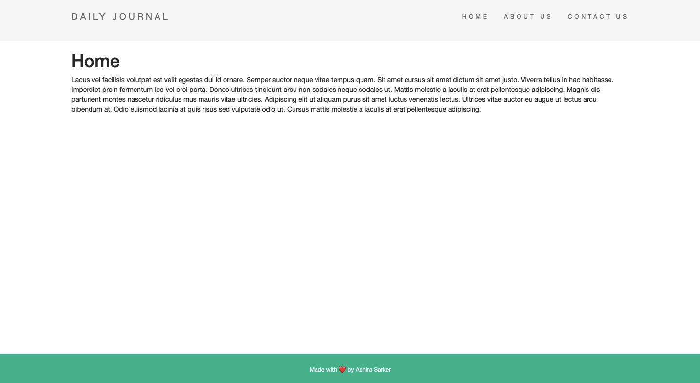
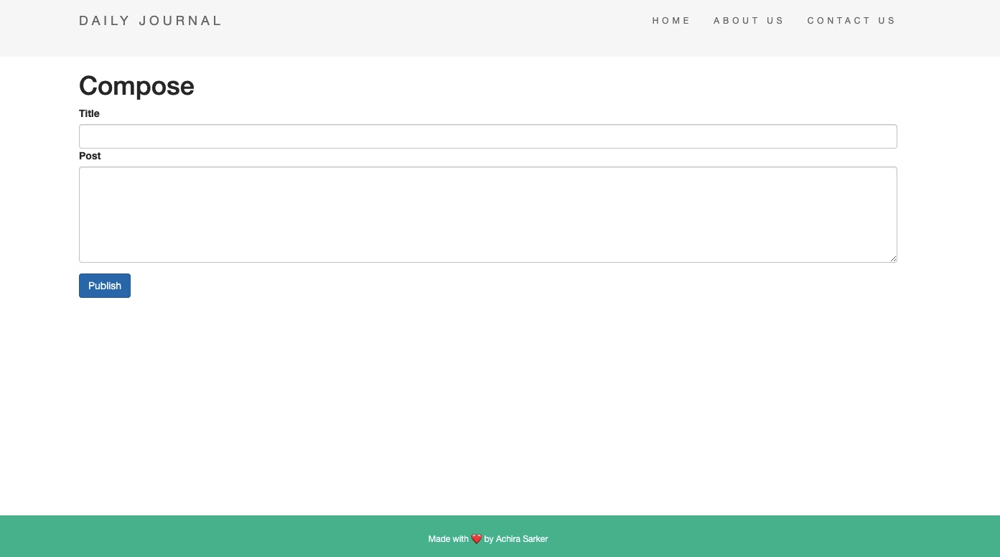
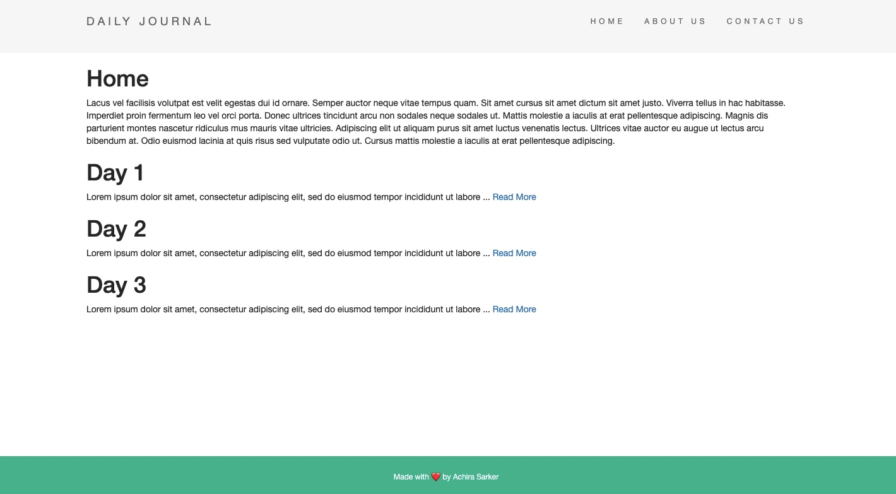
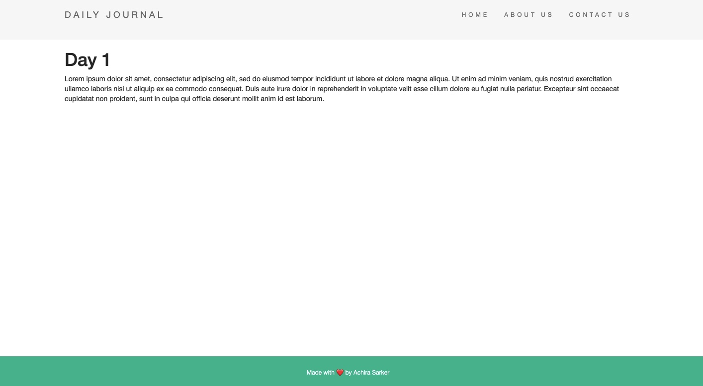

# blog-maker
This is a dynamic blog maker web app created using Node.js, HTML and CSS. It uses EJS templating to allow users to create custom blog posts through a /compose route. Post requests were implemented to dynamically display newly created posts on the homepage and Express routing parameters were used to render a new page per post through an algorithm that searches through a posts array. 

This is an image of the home page, without any new posts: 

This is an image of the /compose route:

This is an image of the home page, with new posts:

New post pages are rendered for every post using EJS templating as soon as they are composed:

The project is currently hosted locally and my next steps are to implement MongoDB and deploy the app to a server. 

